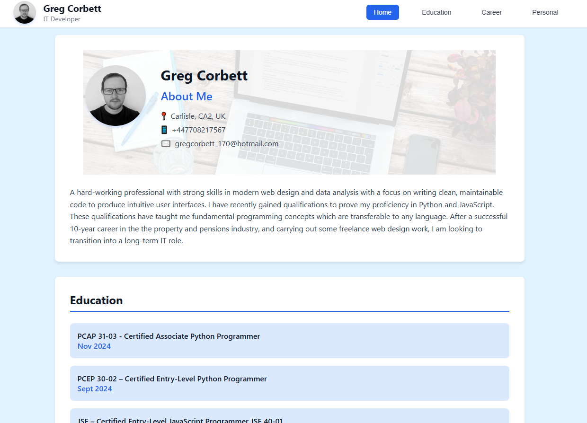

# Digital CV

A modern, responsive digital curriculum vitae built with HTML, CSS, and JavaScript. This project showcases a clean, professional design optimized for both desktop and mobile viewing.

## 🌟 Features

- **Responsive Design**: Fully optimized for desktop, tablet, and mobile devices
- **Modern UI**: Clean, professional layout with smooth animations
- **Interactive Elements**: Enhanced user experience with JavaScript functionality
- **Optimized Images**: WebP format for fast loading times
- **GitHub Pages Ready**: Easily deployable and hostable

## 🚀 Live Demo

Visit the live version: [https://corbey08.github.io/digital-cv/](https://corbey08.github.io/digital-cv/)

## 📸 Preview



## 🛠️ Built With

- **HTML5**: Semantic markup and structure
- **CSS3**: Modern styling with flexbox/grid layouts
- **JavaScript**: Interactive functionality and dynamic content
- **WebP Images**: Optimized image formats for performance

## 📁 Project Structure

```
digital-cv/
├── index.html          # Main HTML file
├── script.js           # JavaScript functionality
├── styles.css          # CSS styling
├── hero-bg.webp        # Hero section background image
├── profile.webp        # Profile/avatar image
├── homepage.png        # Screenshot for README
└── README.md           # Project documentation
```

## 🚀 Getting Started

### Prerequisites

- A modern web browser
- Git (for cloning the repository)

### Installation

1. Clone the repository:
   ```bash
   git clone https://github.com/corbey08/digital-cv.git
   ```

2. Navigate to the project directory:
   ```bash
   cd digital-cv
   ```

3. Open `index.html` in your preferred web browser or set up a local server.

### Local Development

For local development, you can use any of these methods:

**Option 1: Direct File Opening**
- Simply open `index.html` in your web browser

**Option 2: Python HTTP Server**
```bash
# Python 3
python -m http.server 8000

# Python 2
python -m SimpleHTTPServer 8000
```
Then visit `http://localhost:8000`

**Option 3: Node.js HTTP Server**
```bash
npx http-server
```

## 🌐 Deployment

This project is configured for GitHub Pages deployment:

1. Push your changes to the `main` branch
2. Go to your repository settings
3. Navigate to "Pages" section
4. Select "Deploy from a branch" and choose `main`
5. Your site will be available at `https://corbey08.github.io/digital-cv/`

## 📱 Browser Compatibility

- ✅ Chrome (latest)
- ✅ Firefox (latest)
- ✅ Safari (latest)
- ✅ Edge (latest)
- ✅ Mobile browsers (iOS Safari, Chrome Mobile)

## 🎨 Customization

To customize this CV for your own use:

1. **Update Content**: Modify the text content in `index.html`
2. **Replace Images**: 
   - Replace `profile.webp` with your own profile image
   - Replace `hero-bg.webp` with your preferred background
3. **Styling**: Customize colors, fonts, and layout in `styles.css`
4. **Functionality**: Add or modify interactive features in `script.js`

## 📄 License

This project is open source and available under the [MIT License](LICENSE).

## 🤝 Contributing

Contributions, issues, and feature requests are welcome! Feel free to check the [issues page](https://github.com/corbey08/digital-cv/issues).

## 📞 Contact

If you have any questions or suggestions, feel free to reach out!

---

⭐ Don't forget to star this repository if you found it helpful!
